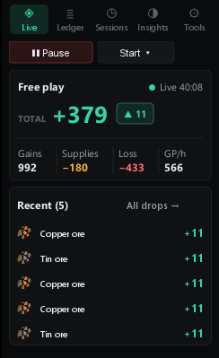
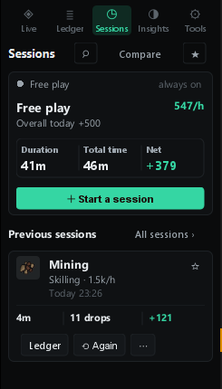
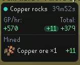

# GP Manager

A RuneLite plugin that works out what you actually made. It watches your inventory, gear and bank changes and keeps the books — you just play.

<p>
  
  
  
</p>

## What you get

- **Live** – your total, gains, supplies, losses and GP/h as you go, plus the last few drops.
- **Ledger** – every gain, cost and trade, with the reason it was counted. Fix anything that's wrong in two clicks.
- **Sessions** – start a named session, or let bank trips, slayer tasks and raids start and end them for you. Compare any two, merge a split trip.
- **Insights** – best days, best hour, records, streaks, top items and activities. PvP has its own view: kills, deaths, K/D, best kills, worst deaths.
- **Wealth** – bank, gear, GE offers and coffers, tracked over time. Never mixed into profit.
- **HUD** – a small box in the game window with your activity, GP/h and total, and floating GP drops if you want them.
- **Alerts** – notable drops, goals reached, wealth milestones. Sessions can end themselves when you go idle.
- **Exports** – CSV of any session, and a full profile backup you can restore.

## How it counts

- Supplies are things it saw you use: food, potions, runes, ammo, charges. Anything else that vanishes is a loss.
- Bank deposits and withdrawals are neutral. So is the Grand Exchange until an offer fills.
- Ground loot doesn't count until it's in your inventory.
- If it isn't sure, it doesn't guess — the row lands in Review with a reason, and you decide.
- Prices come from RuneLite's GE prices, your own overrides, or high-alch if you turn that on.

## Where it keeps things

Everything is local, in `.runelite/gp-manager`, per account. No network calls, nothing automated in-game. Tools › Storage has backup, restore and export.

## Building it yourself

JDK 21, then:

```
gradlew clean releaseCheck
gradlew run
```

`releaseCheck` runs the tests, the accounting simulations and the safety audit. Contributions and bug reports: open an issue with a CSV export from Tools › Storage if you can.

See [SAFETY_POLICY.md](SAFETY_POLICY.md) and the [changelog](CHANGELOG.md).
