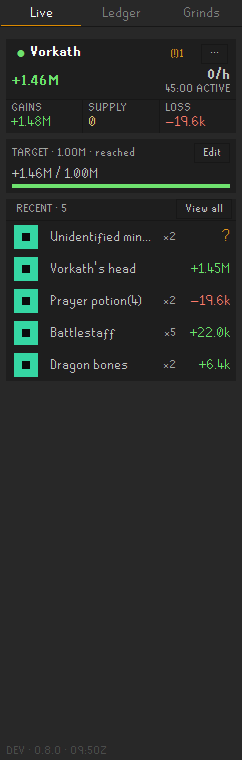
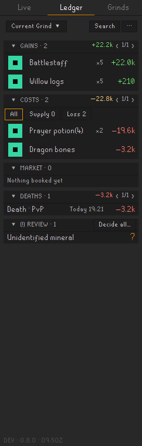
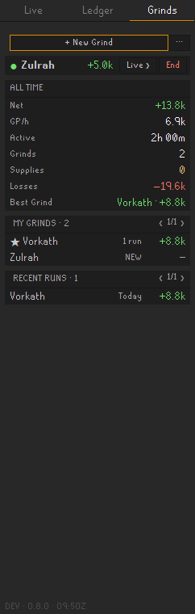
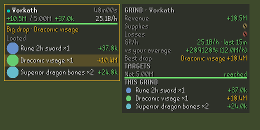
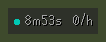

# GP Manager

A RuneLite plugin that works out what you actually made. It watches your inventory, gear and bank changes and keeps the books — you just play.

<p>
  
  
  
</p>
<p>
  
</p>

An empty, untitled run uses one compact row:



## What you get

- **Live** – your Net, gains, supplies, losses and GP/h as you go, and the last few drops. Click the Net to set a target; Start and End a Grind right there, and click its name to rename it.
- **Ledger** – every gain, loss, trade and death, with the reason it was counted. Losses split into Supplies, Items and Charges. Spells you autocast show by name. Open a row to see its receipts; fix any of them from one Correct menu (count it as revenue or a cost, mark it a transfer, exclude it, split it, or undo your latest correction). Anything it wasn't sure about waits in Review for your decision.
- **Grinds** – start a named Grind for what you're doing (Vorkath, Zulrah, a skilling spot), save it with targets, and see every run with its biggest gain and cost and its loot by the monster that dropped it. Between Grinds it tracks Free play on its own.
- **All time** – on the Grinds tab: your total Net, GP/h, active time, Grinds played, supplies and losses, and your best Grind by Net and by GP/h.
- **HUD+** – a compact box in the game window: your Grind (or KC while you fight), Net, GP/h, and a loot tray naming the current kill streak with its Net per kill. When a Grind ends it shows its Net and time.
- **PvP** – kills, deaths, K/D and player loot, only in confidently dangerous areas, and what a death there would risk.
- **Backups** – a copy of your save file you can keep or restore. Older receipts and detail beyond the receipt limit fold into exact totals; the selected retention window governs age-based compaction of closed runs.

## How it counts

- Supplies are things it saw you use: food, potions, runes, ammo, charges. Anything else that vanishes is a loss.
- Bank deposits and withdrawals are neutral. So is the Grand Exchange until an offer fills.
- Ground loot doesn't count until it's in your inventory. Loot keys and chests count when you open them.
- Charged weapons (blowpipe, tridents, the Eye of Ayak and more) are counted as you use them, from the item's own charge recipe; an in-game Check reconciles the running total if you choose to do one.
- If it isn't sure, it doesn't guess — the row lands in Review with a reason, and you decide.
- Prices come from RuneLite's GE prices or your own overrides; unpriced items stay unpriced.

## Where it keeps things

Everything is local, in GP Manager's own folder inside your RuneLite folder, one profile per account; **⚙ › Copy data folder path** shows where. The same menu backs up your profile, restores a backup (the current state is backed up first), clears old backups, or factory-resets it. Backups live in a `backups` folder, newest 10 per account. No network calls of its own, nothing automated in-game, no warnings or combat guidance. Plugin settings open from the wrench in RuneLite's plugin list.

## Building it yourself

JDK 21, then:

```
gradlew clean releaseCheck
gradlew releaseBundle -PpublicRelease=true
gradlew run
```

`releaseBundle -PpublicRelease=true` prepares the public package without development build metadata.

`releaseCheck` runs the tests, the accounting simulations and the safety audit. Contributions and bug reports: open an issue, with a screenshot of the Ledger receipt if you can.
